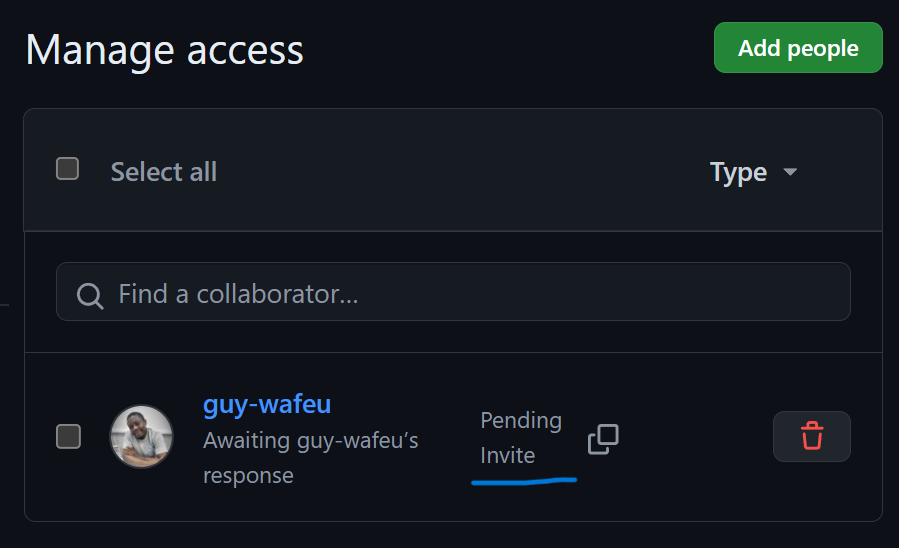
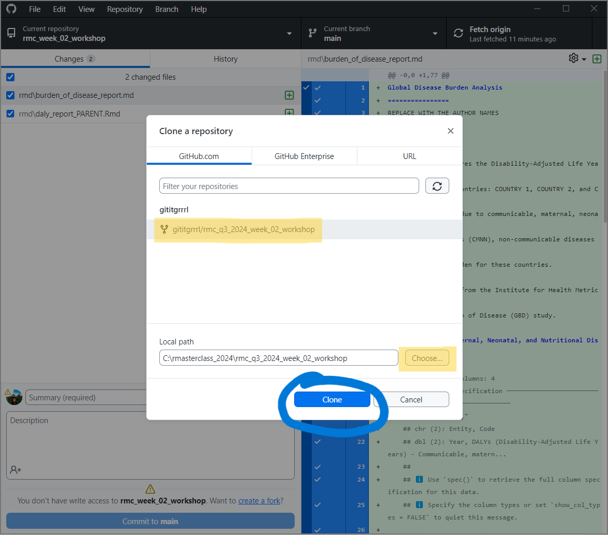

# Introduction

In this workshop, you will work collaboratively in groups of 3 to create a report on the burden of disease for three countries of your choice. The goal is to practice collaborative coding using GitHub, and creating a modular R Markdown report. We have created a minimal example of report [here](https://github.com/the-graph-courses/misc_public/blob/main/rmc_week_02_workshop/rmd/burden_of_disease_report.md).

## Report Structure

Note that the example report is divided into 3 major subsections:

1.  Communicable, Maternal, Neonatal, and Nutritional Disease Burden (CMNN)

2.  Non-Communicable Disease Burden (NCD)

3.  Overall Disease Burden

You and your group members will work together to do the analysis, and each group member will be responsible for one section of the report. If you have only 2 group members, you will only have to complete the first two sections.

## Collaboration workflow

All group members will be pushing and pulling from the same GitHub repo.

{width="589"}

As you may remember from the lesson, merge conflicts can happen when multiple collaborators are working on the same document. To avoid merge conflicts, each member will work on a separate section in separate Rmd files. By splitting the full report into shorter documents, each member can work on their own document without disturbing the others.

1.  **Partner 1 (Repo Owner)** - Section 1: CMNN burden

2.  **Partner 2** - Section 2: NCD burden

3.  **Partner 3** - Section 3: Overall burden

Each group member should take responsibility for completing one of these child documents. When everyone is done, each section will be automatically compiled into one report using a special feature of R Markdown called **child documents** (explained below).

# Parent and Child documents

A single long R Markdown file quickly becomes unwieldy and makes collaboration difficult. We address this by breaking the document up into multiple “child” documents and sourcing these child documents in a "parent" document. Child documents generally represent major subsections of the document.

Example project directory:

-   **.Rproj** – *R project file*

-   **data** – *store data as CSVs*

-   **rmd** – *save all Rmd scripts here*

    -   main_analysis_file.Rmd [**parent**]

    -   analysis_part_01.Rmd [**child**]

    -   analysis_part_02.Rmd [**child**]

    -   analysis_part_03.Rmd [**child**]

Our rmd folder for today looks like this, with one parent Rmd and 3 child Rmds:

Since we’ve organised the three report sections into individual child Rmd files, all we need to do is to “source” these Rmd files into the parent Rmd.

We can call the child documents into the main parent document via the `knitr` chunk option **`child`**. The `child` option takes a character vector of paths to the child documents, e.g., `{r child = c('analysis_part_01.Rmd', 'analysis_part_01.Rmd', 'analysis_part_01.Rmd')}`.

In our case, we need only one empty code chunk in the parent Rmd, with a `child` chunk option that looks like this:

This has already been filled in for you in "daly_report_PARENT.Rmd", so you need not make any changes to that document other than adding author names and country names.

# TASK 1: FORK AND CLONE THE REPO

We will provide a repository for this workshop, hosted on the GRAPH Courses GitHub. Partner 1 will then create a forked copy of the original, and all group members will use that to complete the exercise. Detailed steps are outlined below.

{width="543"}

Before we get started, everyone should **log in to your GitHub accounts and have GitHub Desktop ready to go!**

## Fork original repo (Partner 1)

Pick one group member to be the repo "owner" (Partner 1). They will **fork** the assignment repository from here: <https://github.com/the-graph-courses/rmc_q3_2024_week_02_workshop>.

**NOTE**: Please choose someone who is able to screenshare.

Once Partner 1 forks the repo, a copy of the original will show up on the "Repositories" tab of their personal GitHub profile. This copy of the repo is what your group will be working on.

## Invite collaborators (Partner 1)

Currently, partner 1 is the owner of your group's repo. They now need to add the other group members as collaborators, so that everyone can have permission to pull, edit, and push changes to the repo.

## Accept collaboration invite (Partners 2 & 3)

Now it's time for Partners 2 & 3 to act! **Make sure you sign into [github.com](github.com) on your browser.**

You should can your GitHub notifications or email to accept the invite from Partner 1.

### Option 1: GitHub notifications

You can find your notifications by clicking on the icon or going to [**github.com/notifications**](https://github.com/notifications){.uri}.

### Option 2: Email invitation

### Accept Invitation

You will be directed to a page to accept the invitation.

Now you are officially a collaborator on the workshop 2 repo forked and owned by Partner 1! This gives you admin privileges to make changes and push them to the remote repo.

## Clone the repo to local computers (Everyone)

All group members should then clone the repo to their **local machines**.

### Switch to GitHub Desktop App

Open **GitHub Desktop** on your computer. Navigate to Files > Clone repository.

Once you click clone, it may take a few moments to download everything.

### Set up RStudio for the workshop exercise

Once you have successfully cloned, your GitHub desktop window will look something like this:

Click "**Show in Explorer**" if you are using Windows, or "Show in Finder" if you are using a Mac.

That will open a window showing the contents of the workshop folder. **Open the RStudio project file**.

In the Files tab, open the instructions Rmd, switch to Visual mode, and go to the Task 2 section. Follow the next steps from there.

# TASK 2: ASSIGN CHILD DOCUMENTS

The "rmd" folder of the repo contains a main report file `daly_report_PARENT.Rmd` which will source three child documents:

1.  `01_cmnn_burden_CHILD.Rmd`: This document will be the first section of the report, comparing the DALY burden of **communicable, maternal, neonatal, and nutritional diseases** for the three countries.

2.  `02_ncd_burden_CHILD.Rmd`: This document will be the second section of the report, comparing the DALY burden of **non-communicable diseases** for the three countries.

3.  `03_overall_burden_CHILD.Rmd`: This document will be the third section of the report, comparing the **overall DALY burden** for the three countries.

If there are three group members, each person should complete one child document. If there are two group members, you should only complete the first two child documents.

Discuss among yourselves and **assign one child document to each group member**.

Each group member should open and work ONLY on your assigned child Rmd – avoid make any changes to the other Rmds.

# TASK 3: CHOOSE THREE COUNTRIES

As a group, decide on three countries you want to analyze and compare in your report. Make sure each group member knows which countries were selected.

# TASK 4: COMPLETE THE CHILD DOCUMENTS

Read the commented instructions in your assigned child document and fill in the code for each code chunk, analyzing the DALY burden for the three countries. Main steps to complete the analysis are:

1.  **Load packages and import CSV** (this code is pre-filled for you).

2.  **Filter the data** to your three chosen countries.

3.  **Pivot the dataset** to wide form.

4.  **Render a table** with `kable()`.

5.  **Plot a line graph** showing trends over time.

6.  **Write a paragraph** to summarize your findings.

Each group member should complete these steps, **commit** their changes, and **push** to the remote repo that Partner 1 created.

# TASK 5: RENDER THE MAIN REPORT

Once all group members have completed and pushed their child documents, the repo owner (Partner 1) should pull everyone's changes. After pulling, check that all child documents are filled with the appropriate code.

Then render the main `daly_report_PARENT.Rmd` which will include the completed child docs. There is no need to add any of your code to this document, as the chunk options will import the code from the child documents. You should get an output document called `daly_report_PARENT.md`.

Make sure that only key outputs are displayed in the main report, not the code or package loading messages. The render output should be in **github_document** format.

Partner 1 should then commit and push the final rendered report to GitHub. The other group members can then pull the changes, and the rendered document should appear in your local files.

Finally, go online to your repo and check that the report renders correctly. The images and tables should be visible, as shown in the [example report](https://github.com/the-graph-courses/misc_public/blob/main/rmc_week_02_workshop/rmd/burden_of_disease_report.md).

# CHALLENGE (OPTIONAL)

If your groups finishes early, try to calculate and add a plot showing the *cumulative* DALY burden for the three countries over time, for each of the three burden estimate types.

# TASK 6: SUBMIT

To submit, each group member should should upload the link to the groups GitHub repo as a **text file** (.txt, .docx, .Rmd, or .R).

This link will be for the same repo for all group members. But each group member should submit the link individually, so that your submission is recorded. From the commit history, we will be able to see who contributed to the repo.

# TASK 7: PRESENT (OPTIONAL)

If you finish on time, you may be approached to present one of your plots and summarize what it shows.
