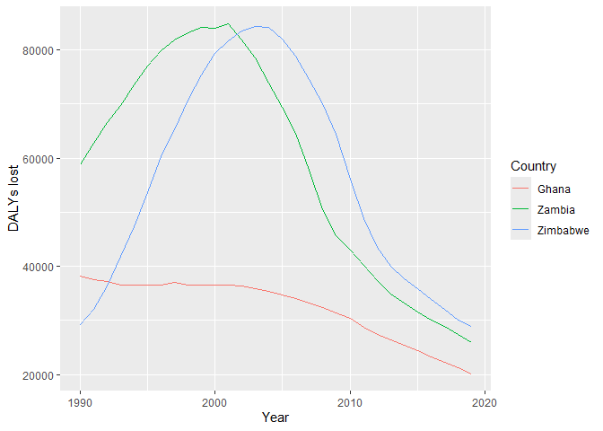
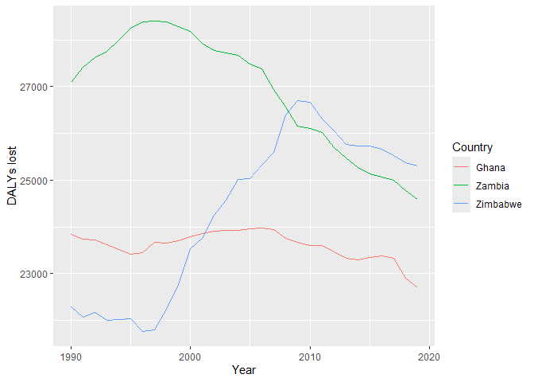
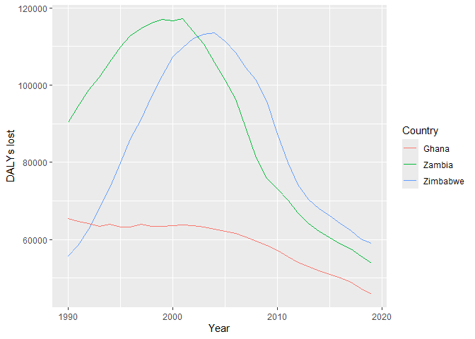

Global Disease Burden Analysis \| Minimum viable report
================
GRAPH Courses Team
2024-07-16

# Introduction

This document synthesizes our analysis of the global disease burden for
selected countries, comparing the burden due to communicable, maternal,
neonatal, and nutritional diseases (CMNN), non-communicable diseases
(NCDs), and overall disease burden. We present tables and plots to
visualize the trends in disease burden over time and provide a summary
of our findings.

# Communicable, Maternal, Neonatal, and Nutritional Disease Burden (CMNN)

## Table of Estimates for CMNN Burden Over Time

| Year | Ghana | Zambia | Zimbabwe |
|-----:|------:|-------:|---------:|
| 1990 | 38169 |  58757 |    29183 |
| 1991 | 37544 |  62679 |    32113 |
| 1992 | 37134 |  66572 |    36385 |
| 1993 | 36581 |  69735 |    41868 |
| 1994 | 36469 |  73466 |    47289 |
| 1995 | 36486 |  77051 |    53692 |
| 1996 | 36604 |  79825 |    60273 |
| 1997 | 37107 |  81799 |    65190 |
| 1998 | 36530 |  83235 |    70773 |
| 1999 | 36492 |  84186 |    75438 |
| 2000 | 36511 |  84062 |    79359 |
| 2001 | 36543 |  84768 |    81583 |
| 2002 | 36337 |  81769 |    83413 |
| 2003 | 35934 |  78563 |    84343 |
| 2004 | 35390 |  73901 |    84160 |
| 2005 | 34746 |  69419 |    82068 |
| 2006 | 34049 |  64637 |    78766 |
| 2007 | 33299 |  57853 |    74505 |
| 2008 | 32442 |  50416 |    70027 |
| 2009 | 31471 |  45610 |    64407 |
| 2010 | 30352 |  42950 |    56041 |
| 2011 | 28746 |  40191 |    48766 |
| 2012 | 27367 |  37372 |    43522 |
| 2013 | 26364 |  34920 |    39995 |
| 2014 | 25361 |  33171 |    37784 |
| 2015 | 24430 |  31649 |    35857 |
| 2016 | 23350 |  30144 |    33901 |
| 2017 | 22337 |  28970 |    32081 |
| 2018 | 21254 |  27432 |    30123 |
| 2019 | 20203 |  25908 |    28869 |

## Plot Showing Trends in CMNN Burden Over Time

<!-- -->

## Summary of CMNN Burden Findings

Zambia and Zimbabwe had big increase due to HIV. Ghana not so much.
Ghana is generally lower. Of course, this is not population-size
adjusted.

# Non-Communicable Disease Burden (NCD)

## Table of Estimates for NCD Burden Over Time

| Year | Ghana | Zambia | Zimbabwe |
|-----:|------:|-------:|---------:|
| 1990 | 23835 |  27086 |    22298 |
| 1991 | 23739 |  27421 |    22078 |
| 1992 | 23729 |  27621 |    22174 |
| 1993 | 23628 |  27755 |    21997 |
| 1994 | 23518 |  27986 |    22021 |
| 1995 | 23415 |  28244 |    22043 |
| 1996 | 23449 |  28385 |    21774 |
| 1997 | 23668 |  28397 |    21797 |
| 1998 | 23649 |  28386 |    22246 |
| 1999 | 23703 |  28279 |    22772 |
| 2000 | 23789 |  28175 |    23534 |
| 2001 | 23861 |  27928 |    23763 |
| 2002 | 23917 |  27779 |    24243 |
| 2003 | 23934 |  27717 |    24570 |
| 2004 | 23934 |  27662 |    25013 |
| 2005 | 23968 |  27478 |    25031 |
| 2006 | 23982 |  27374 |    25326 |
| 2007 | 23947 |  26938 |    25598 |
| 2008 | 23758 |  26572 |    26397 |
| 2009 | 23677 |  26160 |    26694 |
| 2010 | 23609 |  26106 |    26658 |
| 2011 | 23597 |  26019 |    26310 |
| 2012 | 23461 |  25688 |    26052 |
| 2013 | 23332 |  25477 |    25771 |
| 2014 | 23297 |  25271 |    25733 |
| 2015 | 23349 |  25141 |    25730 |
| 2016 | 23380 |  25064 |    25658 |
| 2017 | 23324 |  24993 |    25518 |
| 2018 | 22906 |  24785 |    25381 |
| 2019 | 22703 |  24596 |    25297 |

## Plot Showing Trends in NCD Burden Over Time

<!-- -->

## Summary of NCD Burden Findings

In Zambia it rose in the 90s then started falling.

In Zimbabwe, big rise in 2000s for some reason. Not sure. Maybe artifact
of population pyramid?

# Overall Disease Burden

## Table of Estimates for Overall Disease Burden Over Time

| Year | Ghana | Zambia | Zimbabwe |
|-----:|------:|-------:|---------:|
| 1990 | 65404 |  90311 |    55804 |
| 1991 | 64672 |  94549 |    58436 |
| 1992 | 64200 |  98666 |    62762 |
| 1993 | 63508 | 101975 |    67959 |
| 1994 | 63990 | 105957 |    73502 |
| 1995 | 63253 | 109835 |    79974 |
| 1996 | 63278 | 112825 |    86055 |
| 1997 | 64038 | 114714 |    90953 |
| 1998 | 63423 | 116114 |    97129 |
| 1999 | 63482 | 116929 |   102385 |
| 2000 | 63570 | 116657 |   107262 |
| 2001 | 63814 | 117138 |   109636 |
| 2002 | 63647 | 113863 |   112014 |
| 2003 | 63291 | 110652 |   113242 |
| 2004 | 62781 | 105932 |   113479 |
| 2005 | 62205 | 101322 |   111406 |
| 2006 | 61534 |  96352 |   108431 |
| 2007 | 60740 |  89062 |   104511 |
| 2008 | 59592 |  81162 |   101294 |
| 2009 | 58496 |  75821 |    95878 |
| 2010 | 57275 |  73050 |    87458 |
| 2011 | 55630 |  70178 |    79823 |
| 2012 | 54078 |  66882 |    74247 |
| 2013 | 52929 |  64151 |    70374 |
| 2014 | 51901 |  62125 |    68034 |
| 2015 | 51085 |  60440 |    66169 |
| 2016 | 50031 |  58802 |    64175 |
| 2017 | 48933 |  57513 |    62297 |
| 2018 | 47289 |  55705 |    60085 |
| 2019 | 45965 |  53935 |    58969 |

## Plot Showing Trends in Overall Disease Burden Over Time

<!-- -->

## Summary of Overall Disease Burden Findings

Overall trend seems to be largely driven by the trend from communicable
diseases. So big rises for Zambia & Zimbabwe due to HIV.
