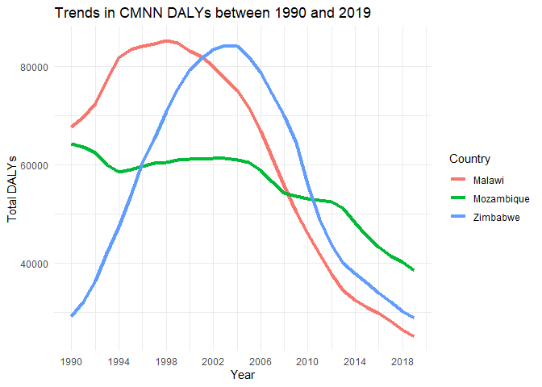
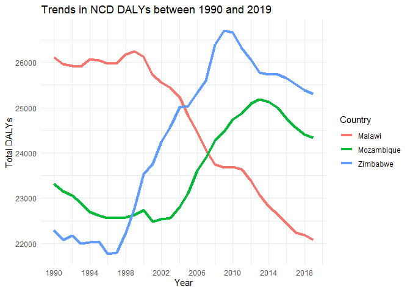
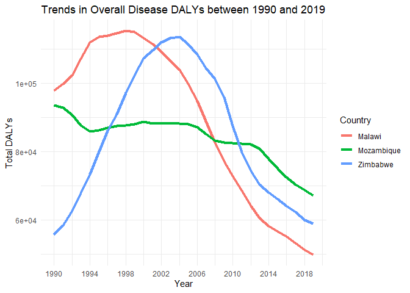

Global Disease Burden Analysis
================
WINGSTON NG’AMBI

# Introduction

This document compares the Disability-Adjusted Life Year (DALY) diseases
burden for three countries: COUNTRY 1, COUNTRY 2, and COUNTRY 3. We
compare the burden due to communicable, maternal, neonatal, and
nutritional diseases (CMNN), non-communicable diseases (NCDs), and
overall disease burden for these countries.

The source data is from the Institute for Health Metrics and Evaluation
(IHME) Global Burden of Disease (GBD) study.

# Communicable, Maternal, Neonatal, and Nutritional Disease Burden (CMNN)

    ## # A tibble: 6 × 4
    ##   Entity Code   Year  DALYs
    ##   <chr>  <chr> <dbl>  <dbl>
    ## 1 Malawi MWI    1990 67721.
    ## 2 Malawi MWI    1991 69612.
    ## 3 Malawi MWI    1992 72426.
    ## 4 Malawi MWI    1993 77205.
    ## 5 Malawi MWI    1994 81870.
    ## 6 Malawi MWI    1995 83524.

## Table of Estimates for CMNN Burden Over Time

| Code | Year |   Malawi | Mozambique | Zimbabwe |
|:-----|-----:|---------:|-----------:|---------:|
| MWI  | 1990 | 67720.68 |         NA |       NA |
| MWI  | 1991 | 69611.68 |         NA |       NA |
| MWI  | 1992 | 72425.84 |         NA |       NA |
| MWI  | 1993 | 77205.15 |         NA |       NA |
| MWI  | 1994 | 81870.48 |         NA |       NA |
| MWI  | 1995 | 83523.82 |         NA |       NA |
| MWI  | 1996 | 84066.40 |         NA |       NA |
| MWI  | 1997 | 84671.35 |         NA |       NA |
| MWI  | 1998 | 85203.76 |         NA |       NA |
| MWI  | 1999 | 84775.65 |         NA |       NA |
| MWI  | 2000 | 83179.92 |         NA |       NA |
| MWI  | 2001 | 81972.65 |         NA |       NA |
| MWI  | 2002 | 80059.14 |         NA |       NA |
| MWI  | 2003 | 77454.71 |         NA |       NA |
| MWI  | 2004 | 75049.23 |         NA |       NA |
| MWI  | 2005 | 71586.95 |         NA |       NA |
| MWI  | 2006 | 66929.50 |         NA |       NA |
| MWI  | 2007 | 61515.38 |         NA |       NA |
| MWI  | 2008 | 55699.27 |         NA |       NA |
| MWI  | 2009 | 50335.60 |         NA |       NA |
| MWI  | 2010 | 45957.25 |         NA |       NA |
| MWI  | 2011 | 41755.34 |         NA |       NA |
| MWI  | 2012 | 37589.36 |         NA |       NA |
| MWI  | 2013 | 34434.73 |         NA |       NA |
| MWI  | 2014 | 32365.33 |         NA |       NA |
| MWI  | 2015 | 30933.41 |         NA |       NA |
| MWI  | 2016 | 29834.47 |         NA |       NA |
| MWI  | 2017 | 28119.98 |         NA |       NA |
| MWI  | 2018 | 26372.76 |         NA |       NA |
| MWI  | 2019 | 25068.66 |         NA |       NA |
| MOZ  | 1990 |       NA |   64254.32 |       NA |
| MOZ  | 1991 |       NA |   63627.72 |       NA |
| MOZ  | 1992 |       NA |   62522.07 |       NA |
| MOZ  | 1993 |       NA |   59996.28 |       NA |
| MOZ  | 1994 |       NA |   58429.30 |       NA |
| MOZ  | 1995 |       NA |   59049.12 |       NA |
| MOZ  | 1996 |       NA |   59706.78 |       NA |
| MOZ  | 1997 |       NA |   60250.91 |       NA |
| MOZ  | 1998 |       NA |   60433.95 |       NA |
| MOZ  | 1999 |       NA |   60898.13 |       NA |
| MOZ  | 2000 |       NA |   61103.20 |       NA |
| MOZ  | 2001 |       NA |   61194.80 |       NA |
| MOZ  | 2002 |       NA |   61299.04 |       NA |
| MOZ  | 2003 |       NA |   61279.78 |       NA |
| MOZ  | 2004 |       NA |   60976.50 |       NA |
| MOZ  | 2005 |       NA |   60513.20 |       NA |
| MOZ  | 2006 |       NA |   58839.81 |       NA |
| MOZ  | 2007 |       NA |   56596.99 |       NA |
| MOZ  | 2008 |       NA |   54296.63 |       NA |
| MOZ  | 2009 |       NA |   53521.09 |       NA |
| MOZ  | 2010 |       NA |   53116.19 |       NA |
| MOZ  | 2011 |       NA |   52757.98 |       NA |
| MOZ  | 2012 |       NA |   52450.28 |       NA |
| MOZ  | 2013 |       NA |   51062.50 |       NA |
| MOZ  | 2014 |       NA |   48223.45 |       NA |
| MOZ  | 2015 |       NA |   45443.42 |       NA |
| MOZ  | 2016 |       NA |   43276.38 |       NA |
| MOZ  | 2017 |       NA |   41490.64 |       NA |
| MOZ  | 2018 |       NA |   40058.20 |       NA |
| MOZ  | 2019 |       NA |   38518.81 |       NA |
| ZWE  | 1990 |       NA |         NA | 29182.84 |
| ZWE  | 1991 |       NA |         NA | 32113.44 |
| ZWE  | 1992 |       NA |         NA | 36384.90 |
| ZWE  | 1993 |       NA |         NA | 41867.97 |
| ZWE  | 1994 |       NA |         NA | 47289.24 |
| ZWE  | 1995 |       NA |         NA | 53692.06 |
| ZWE  | 1996 |       NA |         NA | 60272.88 |
| ZWE  | 1997 |       NA |         NA | 65190.26 |
| ZWE  | 1998 |       NA |         NA | 70772.80 |
| ZWE  | 1999 |       NA |         NA | 75437.72 |
| ZWE  | 2000 |       NA |         NA | 79358.74 |
| ZWE  | 2001 |       NA |         NA | 81582.84 |
| ZWE  | 2002 |       NA |         NA | 83412.85 |
| ZWE  | 2003 |       NA |         NA | 84342.70 |
| ZWE  | 2004 |       NA |         NA | 84159.96 |
| ZWE  | 2005 |       NA |         NA | 82067.60 |
| ZWE  | 2006 |       NA |         NA | 78766.43 |
| ZWE  | 2007 |       NA |         NA | 74505.40 |
| ZWE  | 2008 |       NA |         NA | 70026.66 |
| ZWE  | 2009 |       NA |         NA | 64407.06 |
| ZWE  | 2010 |       NA |         NA | 56041.49 |
| ZWE  | 2011 |       NA |         NA | 48765.60 |
| ZWE  | 2012 |       NA |         NA | 43521.72 |
| ZWE  | 2013 |       NA |         NA | 39995.27 |
| ZWE  | 2014 |       NA |         NA | 37784.19 |
| ZWE  | 2015 |       NA |         NA | 35857.23 |
| ZWE  | 2016 |       NA |         NA | 33900.75 |
| ZWE  | 2017 |       NA |         NA | 32081.00 |
| ZWE  | 2018 |       NA |         NA | 30123.21 |
| ZWE  | 2019 |       NA |         NA | 28868.75 |

## Plot Showing Trends in CMNN Burden Over Time

    ## Warning: Using `size` aesthetic for lines was deprecated in ggplot2 3.4.0.
    ## ℹ Please use `linewidth` instead.
    ## This warning is displayed once every 8 hours.
    ## Call `lifecycle::last_lifecycle_warnings()` to see where this warning was
    ## generated.

<!-- -->

## Summary of CMNN Burden Findings

The DALYs for Malawi and Mozambique were dropping over time between 1990
and 2019. The DALYs for Zimbabwe increased between 190 and 2004 and
later started dropping between 2004 and 2019. After 2010, Malawi had the
least DALYs while Mozambique had the highest DALYs.

# Non-Communicable Disease Burden (NCD)

    ## # A tibble: 6 × 4
    ##   Entity Code   Year  DALYs
    ##   <chr>  <chr> <dbl>  <dbl>
    ## 1 Malawi MWI    1990 26111.
    ## 2 Malawi MWI    1991 25959.
    ## 3 Malawi MWI    1992 25917.
    ## 4 Malawi MWI    1993 25907.
    ## 5 Malawi MWI    1994 26069.
    ## 6 Malawi MWI    1995 26047.

## Table of Estimates for NCD Burden Over Time

| Code | Year |   Malawi | Mozambique | Zimbabwe |
|:-----|-----:|---------:|-----------:|---------:|
| MWI  | 1990 | 26110.73 |         NA |       NA |
| MWI  | 1991 | 25958.66 |         NA |       NA |
| MWI  | 1992 | 25916.86 |         NA |       NA |
| MWI  | 1993 | 25906.62 |         NA |       NA |
| MWI  | 1994 | 26069.36 |         NA |       NA |
| MWI  | 1995 | 26047.46 |         NA |       NA |
| MWI  | 1996 | 25974.52 |         NA |       NA |
| MWI  | 1997 | 25977.72 |         NA |       NA |
| MWI  | 1998 | 26173.10 |         NA |       NA |
| MWI  | 1999 | 26245.34 |         NA |       NA |
| MWI  | 2000 | 26124.75 |         NA |       NA |
| MWI  | 2001 | 25721.95 |         NA |       NA |
| MWI  | 2002 | 25552.50 |         NA |       NA |
| MWI  | 2003 | 25440.97 |         NA |       NA |
| MWI  | 2004 | 25237.83 |         NA |       NA |
| MWI  | 2005 | 24813.51 |         NA |       NA |
| MWI  | 2006 | 24457.66 |         NA |       NA |
| MWI  | 2007 | 24066.02 |         NA |       NA |
| MWI  | 2008 | 23745.79 |         NA |       NA |
| MWI  | 2009 | 23676.73 |         NA |       NA |
| MWI  | 2010 | 23695.54 |         NA |       NA |
| MWI  | 2011 | 23639.66 |         NA |       NA |
| MWI  | 2012 | 23378.73 |         NA |       NA |
| MWI  | 2013 | 23074.74 |         NA |       NA |
| MWI  | 2014 | 22817.03 |         NA |       NA |
| MWI  | 2015 | 22639.25 |         NA |       NA |
| MWI  | 2016 | 22459.70 |         NA |       NA |
| MWI  | 2017 | 22233.32 |         NA |       NA |
| MWI  | 2018 | 22179.48 |         NA |       NA |
| MWI  | 2019 | 22082.07 |         NA |       NA |
| MOZ  | 1990 |       NA |   23308.63 |       NA |
| MOZ  | 1991 |       NA |   23150.08 |       NA |
| MOZ  | 1992 |       NA |   23053.11 |       NA |
| MOZ  | 1993 |       NA |   22901.03 |       NA |
| MOZ  | 1994 |       NA |   22702.92 |       NA |
| MOZ  | 1995 |       NA |   22610.47 |       NA |
| MOZ  | 1996 |       NA |   22559.93 |       NA |
| MOZ  | 1997 |       NA |   22566.40 |       NA |
| MOZ  | 1998 |       NA |   22574.94 |       NA |
| MOZ  | 1999 |       NA |   22624.17 |       NA |
| MOZ  | 2000 |       NA |   22737.24 |       NA |
| MOZ  | 2001 |       NA |   22482.33 |       NA |
| MOZ  | 2002 |       NA |   22540.54 |       NA |
| MOZ  | 2003 |       NA |   22562.94 |       NA |
| MOZ  | 2004 |       NA |   22801.82 |       NA |
| MOZ  | 2005 |       NA |   23115.28 |       NA |
| MOZ  | 2006 |       NA |   23610.38 |       NA |
| MOZ  | 2007 |       NA |   23892.64 |       NA |
| MOZ  | 2008 |       NA |   24261.65 |       NA |
| MOZ  | 2009 |       NA |   24466.66 |       NA |
| MOZ  | 2010 |       NA |   24734.84 |       NA |
| MOZ  | 2011 |       NA |   24874.33 |       NA |
| MOZ  | 2012 |       NA |   25089.74 |       NA |
| MOZ  | 2013 |       NA |   25175.16 |       NA |
| MOZ  | 2014 |       NA |   25121.70 |       NA |
| MOZ  | 2015 |       NA |   24996.46 |       NA |
| MOZ  | 2016 |       NA |   24758.85 |       NA |
| MOZ  | 2017 |       NA |   24569.82 |       NA |
| MOZ  | 2018 |       NA |   24405.91 |       NA |
| MOZ  | 2019 |       NA |   24334.45 |       NA |
| ZWE  | 1990 |       NA |         NA | 22297.56 |
| ZWE  | 1991 |       NA |         NA | 22078.26 |
| ZWE  | 1992 |       NA |         NA | 22174.33 |
| ZWE  | 1993 |       NA |         NA | 21996.56 |
| ZWE  | 1994 |       NA |         NA | 22021.09 |
| ZWE  | 1995 |       NA |         NA | 22042.96 |
| ZWE  | 1996 |       NA |         NA | 21774.05 |
| ZWE  | 1997 |       NA |         NA | 21796.51 |
| ZWE  | 1998 |       NA |         NA | 22245.64 |
| ZWE  | 1999 |       NA |         NA | 22772.21 |
| ZWE  | 2000 |       NA |         NA | 23533.63 |
| ZWE  | 2001 |       NA |         NA | 23763.29 |
| ZWE  | 2002 |       NA |         NA | 24243.05 |
| ZWE  | 2003 |       NA |         NA | 24570.26 |
| ZWE  | 2004 |       NA |         NA | 25012.97 |
| ZWE  | 2005 |       NA |         NA | 25031.35 |
| ZWE  | 2006 |       NA |         NA | 25326.42 |
| ZWE  | 2007 |       NA |         NA | 25598.20 |
| ZWE  | 2008 |       NA |         NA | 26396.70 |
| ZWE  | 2009 |       NA |         NA | 26693.76 |
| ZWE  | 2010 |       NA |         NA | 26658.05 |
| ZWE  | 2011 |       NA |         NA | 26309.51 |
| ZWE  | 2012 |       NA |         NA | 26052.00 |
| ZWE  | 2013 |       NA |         NA | 25770.62 |
| ZWE  | 2014 |       NA |         NA | 25733.12 |
| ZWE  | 2015 |       NA |         NA | 25729.90 |
| ZWE  | 2016 |       NA |         NA | 25657.87 |
| ZWE  | 2017 |       NA |         NA | 25518.09 |
| ZWE  | 2018 |       NA |         NA | 25381.47 |
| ZWE  | 2019 |       NA |         NA | 25297.14 |

## Plot Showing Trends in NCD Burden Over Time

<!-- -->

## Summary of NCD Burden Findings

The DALYs for Malawi were dropping over time between 1990 and 2019. On
the other hand, the DALYs for Mozambique and Zimbabwe were increasing
over time between 1999 and 2010. After 2010, the DALYs started dropping
over time.

# Overall Disease Burden

    ## # A tibble: 6 × 4
    ##   Entity Code   Year   DALYs
    ##   <chr>  <chr> <dbl>   <dbl>
    ## 1 Malawi MWI    1990  97882.
    ## 2 Malawi MWI    1991  99872.
    ## 3 Malawi MWI    1992 102367.
    ## 4 Malawi MWI    1993 107117.
    ## 5 Malawi MWI    1994 111968.
    ## 6 Malawi MWI    1995 113576.

## Table of Estimates for Overall Disease Burden Over Time

| Code | Year |    Malawi | Mozambique |  Zimbabwe |
|:-----|-----:|----------:|-----------:|----------:|
| MWI  | 1990 |  97882.42 |         NA |        NA |
| MWI  | 1991 |  99871.76 |         NA |        NA |
| MWI  | 1992 | 102367.38 |         NA |        NA |
| MWI  | 1993 | 107117.21 |         NA |        NA |
| MWI  | 1994 | 111968.46 |         NA |        NA |
| MWI  | 1995 | 113576.19 |         NA |        NA |
| MWI  | 1996 | 113979.33 |         NA |        NA |
| MWI  | 1997 | 114548.05 |         NA |        NA |
| MWI  | 1998 | 115263.66 |         NA |        NA |
| MWI  | 1999 | 114929.63 |         NA |        NA |
| MWI  | 2000 | 113194.41 |         NA |        NA |
| MWI  | 2001 | 111499.98 |         NA |        NA |
| MWI  | 2002 | 109321.05 |         NA |        NA |
| MWI  | 2003 | 106545.37 |         NA |        NA |
| MWI  | 2004 | 103871.94 |         NA |        NA |
| MWI  | 2005 |  99897.53 |         NA |        NA |
| MWI  | 2006 |  94775.85 |         NA |        NA |
| MWI  | 2007 |  88888.28 |         NA |        NA |
| MWI  | 2008 |  82651.62 |         NA |        NA |
| MWI  | 2009 |  77209.61 |         NA |        NA |
| MWI  | 2010 |  72839.92 |         NA |        NA |
| MWI  | 2011 |  68592.04 |         NA |        NA |
| MWI  | 2012 |  64107.39 |         NA |        NA |
| MWI  | 2013 |  60556.38 |         NA |        NA |
| MWI  | 2014 |  58166.80 |         NA |        NA |
| MWI  | 2015 |  56611.56 |         NA |        NA |
| MWI  | 2016 |  55184.54 |         NA |        NA |
| MWI  | 2017 |  53182.40 |         NA |        NA |
| MWI  | 2018 |  51357.91 |         NA |        NA |
| MWI  | 2019 |  49931.02 |         NA |        NA |
| MOZ  | 1990 |        NA |   93511.33 |        NA |
| MOZ  | 1991 |        NA |   92827.07 |        NA |
| MOZ  | 1992 |        NA |   90773.20 |        NA |
| MOZ  | 1993 |        NA |   87752.15 |        NA |
| MOZ  | 1994 |        NA |   85941.05 |        NA |
| MOZ  | 1995 |        NA |   86334.49 |        NA |
| MOZ  | 1996 |        NA |   86909.73 |        NA |
| MOZ  | 1997 |        NA |   87428.74 |        NA |
| MOZ  | 1998 |        NA |   87619.46 |        NA |
| MOZ  | 1999 |        NA |   88112.97 |        NA |
| MOZ  | 2000 |        NA |   88713.12 |        NA |
| MOZ  | 2001 |        NA |   88177.56 |        NA |
| MOZ  | 2002 |        NA |   88331.12 |        NA |
| MOZ  | 2003 |        NA |   88240.03 |        NA |
| MOZ  | 2004 |        NA |   88190.70 |        NA |
| MOZ  | 2005 |        NA |   88096.35 |        NA |
| MOZ  | 2006 |        NA |   87082.95 |        NA |
| MOZ  | 2007 |        NA |   85247.78 |        NA |
| MOZ  | 2008 |        NA |   83294.01 |        NA |
| MOZ  | 2009 |        NA |   82682.28 |        NA |
| MOZ  | 2010 |        NA |   82545.42 |        NA |
| MOZ  | 2011 |        NA |   82254.29 |        NA |
| MOZ  | 2012 |        NA |   82156.99 |        NA |
| MOZ  | 2013 |        NA |   80853.06 |        NA |
| MOZ  | 2014 |        NA |   77894.57 |        NA |
| MOZ  | 2015 |        NA |   74986.73 |        NA |
| MOZ  | 2016 |        NA |   72487.83 |        NA |
| MOZ  | 2017 |        NA |   70413.81 |        NA |
| MOZ  | 2018 |        NA |   68801.19 |        NA |
| MOZ  | 2019 |        NA |   67259.91 |        NA |
| ZWE  | 1990 |        NA |         NA |  55804.06 |
| ZWE  | 1991 |        NA |         NA |  58436.03 |
| ZWE  | 1992 |        NA |         NA |  62761.58 |
| ZWE  | 1993 |        NA |         NA |  67959.09 |
| ZWE  | 1994 |        NA |         NA |  73502.46 |
| ZWE  | 1995 |        NA |         NA |  79973.89 |
| ZWE  | 1996 |        NA |         NA |  86054.64 |
| ZWE  | 1997 |        NA |         NA |  90952.65 |
| ZWE  | 1998 |        NA |         NA |  97129.02 |
| ZWE  | 1999 |        NA |         NA | 102385.07 |
| ZWE  | 2000 |        NA |         NA | 107261.71 |
| ZWE  | 2001 |        NA |         NA | 109635.81 |
| ZWE  | 2002 |        NA |         NA | 112014.13 |
| ZWE  | 2003 |        NA |         NA | 113242.14 |
| ZWE  | 2004 |        NA |         NA | 113479.27 |
| ZWE  | 2005 |        NA |         NA | 111406.39 |
| ZWE  | 2006 |        NA |         NA | 108431.35 |
| ZWE  | 2007 |        NA |         NA | 104511.30 |
| ZWE  | 2008 |        NA |         NA | 101294.45 |
| ZWE  | 2009 |        NA |         NA |  95878.42 |
| ZWE  | 2010 |        NA |         NA |  87458.32 |
| ZWE  | 2011 |        NA |         NA |  79822.55 |
| ZWE  | 2012 |        NA |         NA |  74246.77 |
| ZWE  | 2013 |        NA |         NA |  70374.05 |
| ZWE  | 2014 |        NA |         NA |  68034.22 |
| ZWE  | 2015 |        NA |         NA |  66169.40 |
| ZWE  | 2016 |        NA |         NA |  64174.96 |
| ZWE  | 2017 |        NA |         NA |  62297.15 |
| ZWE  | 2018 |        NA |         NA |  60084.52 |
| ZWE  | 2019 |        NA |         NA |  58969.11 |

## Plot Showing Trends in Overall Disease Burden Over Time

<!-- -->

## Summary of Overall Disease Burden Findings

Between 1990 and 2019, Malawi and Mozambique had declining overall
disease DALYs. The overall disease DALYs for Mozambique increased over
time between 1990 and 2004, and later dropped over time.After 2010,
Malawi had the least DALYs while Mozambique had the highest DALYs.
